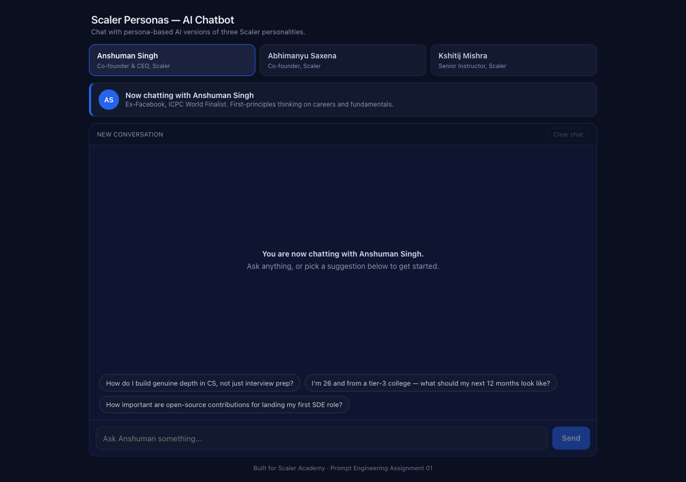
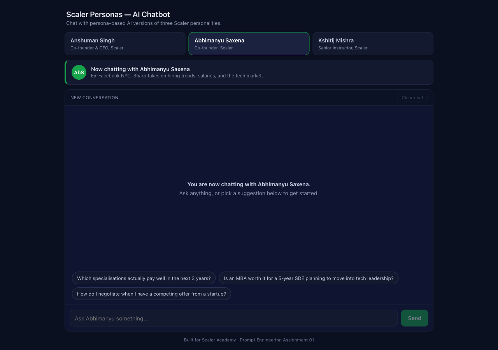
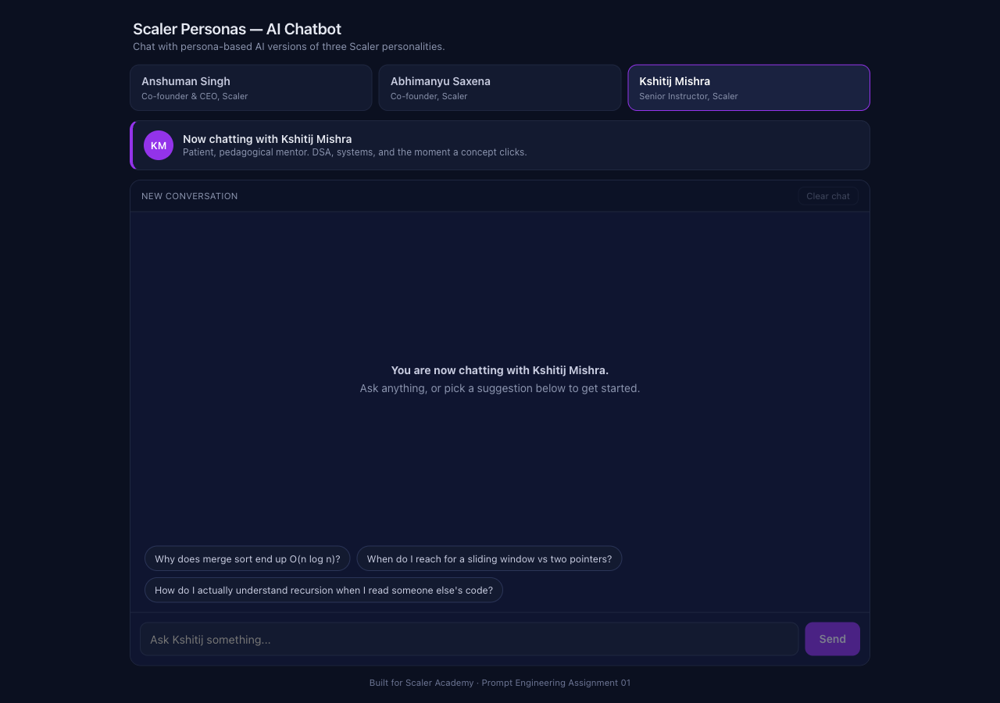

# Scaler Personas — AI Chatbot

Persona-based chatbot. You pick one of three Scaler/InterviewBit personalities — Anshuman Singh, Abhimanyu Saxena, or Kshitij Mishra — and chat with a Gemini-backed version of them, each running on its own hand-crafted system prompt.

Built as my submission for Scaler Academy's Prompt Engineering Assignment 01.

## Live demo

Live URL: _add your Vercel URL here once deployed._

## Screenshots





> Take three screenshots after deploy (one per active persona) and drop them in `docs/` with the filenames above.

## What's in here

Three personas, each with its own system prompt covering background, voice, internal chain-of-thought, output format, few-shots, and hard constraints. The persona switcher swaps the system prompt and **resets the conversation**. The active conversation is kept in `localStorage` so a page refresh doesn't wipe it. Switching personas is locked while a reply is in flight so you can't interrupt the model mid-response, and there's a Clear chat button when you want a fresh start without changing personas.

The Gemini API key lives in a server-side env var. It never reaches the browser.

## Tech

- Next.js 16 (App Router) + TypeScript
- Google Gemini (`gemini-2.5-flash-lite`, free tier)
- Vanilla CSS, no Tailwind
- Deployed on Vercel

## Running locally

```bash
git clone <your-repo-url>
cd my-chatbot
npm install
cp .env.example .env.local
```

Grab a free Gemini key from https://aistudio.google.com/apikey, paste it into `.env.local`:

```
GEMINI_API_KEY=...
GEMINI_MODEL=gemini-2.5-flash-lite
```

Then:

```bash
npm run dev
```

Open http://localhost:3000.

## Deploying

Push to GitHub, import the repo on Vercel, add `GEMINI_API_KEY` (and optionally `GEMINI_MODEL`) under Project Settings → Environment Variables, deploy. `.env.local` stays out of git via `.gitignore`; `.env.example` is the template that's safe to commit.

## Where the prompt work lives

All three system prompts are in `lib/personas.ts`. Each one has six sections: identity, voice, CoT, output format, few-shots, constraints. The reasoning behind each choice is in [`prompts.md`](./prompts.md).

## Layout

```
app/
  api/chat/route.ts   # server-side Gemini call (key stays here)
  globals.css
  layout.tsx
  page.tsx            # active-persona state
components/
  ChatWindow.tsx
  MessageBubble.tsx
  PersonaSwitcher.tsx
  SuggestionChips.tsx
  TypingIndicator.tsx
lib/
  personas.ts         # the three system prompts + metadata
prompts.md            # annotated prompts (assignment artefact)
reflection.md         # 300–500 word reflection (assignment artefact)
```

## Submission checklist

- [x] Public GitHub repo
- [x] README, `prompts.md`, `reflection.md`
- [x] `.env.example` committed, real key kept out of git
- [x] All three personas working
- [x] Persona switcher with per-persona history
- [x] API errors handled gracefully
- [x] Mobile responsive
- [ ] Deployed live URL (paste it in the Live demo section above)
